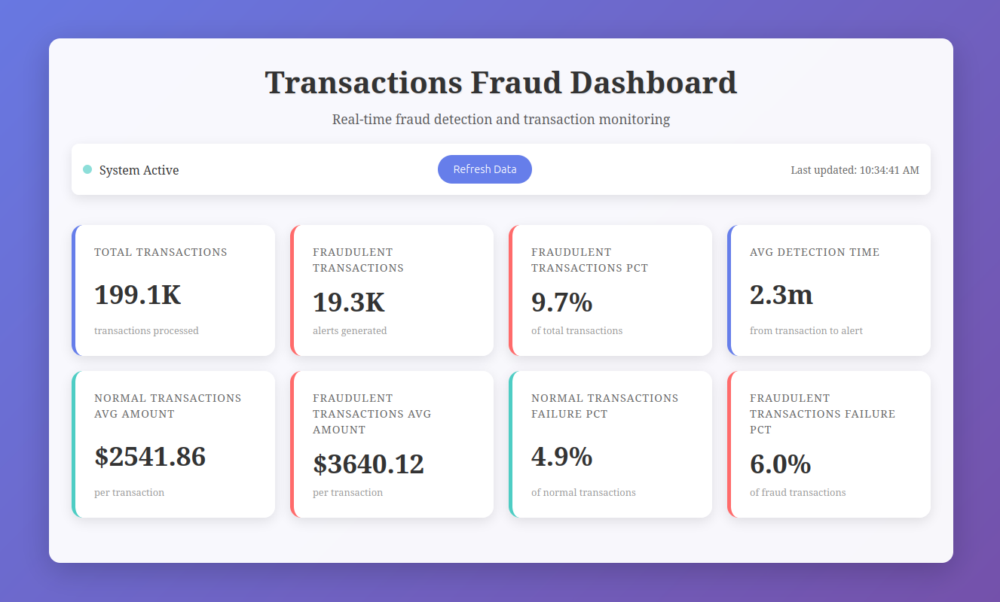
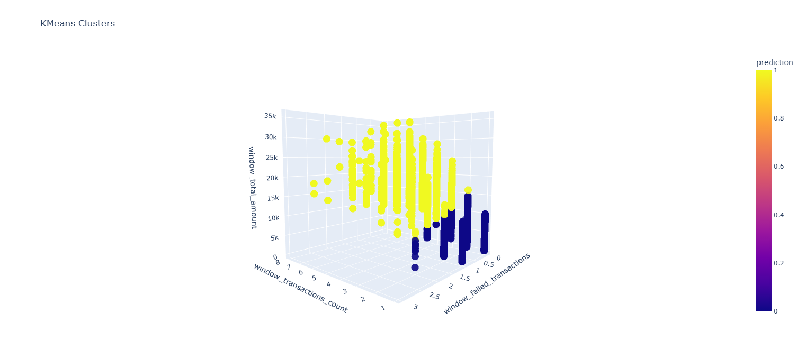

# Fraud Detection Streaming Pipeline

## Overview
This project implements an end-to-end real-time data pipeline for processing financial transactions and detecting potential fraud.
<br>

#### Architecture:

<br>

#### Main Components:
- **Docker and Docker Compose 3.8:** Containerizing and orchestrating the pipeline.
- **Python 3.11:** Script generating financial transactions with controlled fraud patterns as Avro-serialized messages and publishing them to Kafka.
- **Apache Kafka 7.5.0:** Single-node Kafka broker running in KRaft mode and streaming transactions to downstream consumers (Connect and Spark).
- **Confluent Schema Registry 7.5.0:** Storing and managing Avro schema for Kafka messages.
- **Kafka Connect 7.5.0:** Framework with sink connector for ingesting transactions from Kafka and writing them to a Cassandra table.
- **Alpine/curl 8.14.1:** Utility service for applying the Cassandra sink connector configuration once Kafka Connect is ready.
- **Apache Spark ML 3.5.0:** Training a KMeans clustering model to detect fraudulent transactions.
- **Apache Spark Structured Streaming 3.5.0:** Reading transactions from Kafka, applying the KMeans model and writing alerts to a Cassandra table, and performing calculations and writing metrics to another Cassandra table.
- **Cassandra 5.0.4:** Scalable high throughput database storing raw transactions, fraud alerts, and metrics.
- **Flask 2.3.2:** Providing a web-based dashboard to visualize real-time metrics.
<br>

#### Dashboard:

<br>

#### Model Training:
The fraud detection system relies on a KMeans clustering model to identify fraudulent transactions. The model is trained using a static dataset (train_df.csv) that mirrors the schema of the streaming data.
The training process involves:
- Data Preprocessing: Transactions are aggregated into 1-minute windows by sender account, calculating features such as transaction count, total amount, and failed transaction count.
- Feature Engineering: A VectorAssembler combines these features into a feature vector, which is then standardized using StandardScaler to ensure consistent scaling.
- Model Training: A KMeans model with k=2 clusters (normal and fraudulent) is trained using the processed features.

Training Results:
- Silhouette Score: 0.9044, indicating excellent cluster separation.

Cluster Distribution:
- Cluster 0 (Normal): 193,365 transactions (91.62%)
- Cluster 1 (Fraudulent): 17,683 transactions (8.38%)

<br>

#### Project Structure:
```
.
├── cassandra
│   ├── init.cql
│   └── init.sh
├── config.yml
├── connectors
│   ├── cassandra-sink.json
│   └── jars
├── docker-compose.yml
├── flask
│   ├── app.py
│   ├── Dockerfile
│   ├── requirements.txt
│   └── templates
│       └── index.html
├── producer
│   ├── Dockerfile
│   ├── producer.py
│   └── requirements.txt
├── schema.avsc
└── spark
    ├── jars
    └── spark_apps
        ├── Dockerfile
        ├── fraud_detection.py
        ├── kmeans_model
        ├── kmeans_model_training.py
        └── requirements.txt
```

## Setup
- Prerequisites: Docker and Docker Compose 3.8
- Clone the repo ```git clone <repo_url>``` and navigate to project root directory ```cd <project_dir>```.
- Download the Cassandra connector jar listed in /connectors/jars/jar-to-download.txt to the same directory.
- Pull, build, and run containers ```docker-compose up -d --build```.
- View the dashboard ```http://localhost:5000```.
